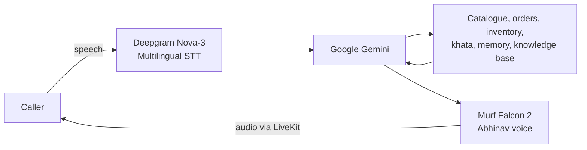

# Mitra — Local Commerce Voice Assistant

Mitra is a multilingual voice assistant for Indian local commerce. It helps customers discover products from artisans, MSMEs, neighbourhood shops, and street vendors, prepare pickup or delivery order requests, and retrieve sourced guidance. It also gives shopkeepers simple voice tools for inventory checks and khata entries.

The application combines a Python LiveKit voice agent with a Next.js web interface and Murf Falcon speech synthesis.

## What Mitra can do

- Search a local product catalogue by product, category, seller, or item ID
- Explain listed prices and availability without presenting them as seller-confirmed
- Collect and read back order details before recording an order request
- Support pickup and delivery requests
- Check shop inventory and record khata credit entries
- Answer supported scheme and farming questions from local, source-labelled documents
- Recognize common Hindi, English, and Romanized Hindi shopping terms
- Respond in the caller's language, including conversational Hinglish
- Remember returning callers only after explicit consent
- Delete a caller's saved memory on request
- Escalate disputes and seller-controlled decisions without requesting sensitive financial data

## Voice pipeline



The backend also uses Silero VAD, LiveKit's multilingual turn detector, and LiveKit noise cancellation.

## Tech stack

| Area | Technology |
| --- | --- |
| Voice agent | Python 3.10+, LiveKit Agents 1.4 |
| Speech-to-text | Deepgram Nova-3 (`multi`) |
| Language model | Google Gemini 3.5 Flash Lite |
| Text-to-speech | Murf Falcon 2, `Abhinav` voice |
| Turn detection | Silero VAD + LiveKit Multilingual Turn Detector |
| Caller memory | SQLite |
| Knowledge retrieval | Local Markdown document retriever |
| Web app | Next.js 15, React 19, TypeScript, Tailwind CSS 4 |
| Package managers | `uv` and `pnpm` |

## Prerequisites

- Python 3.10–3.14
- [uv](https://docs.astral.sh/uv/)
- Node.js 20+
- [pnpm](https://pnpm.io/) 9+
- A [LiveKit Cloud](https://cloud.livekit.io/) project, or a local `livekit-server`
- API keys for [Murf](https://murf.ai/api/dashboard), [Deepgram](https://deepgram.com/), and [Google AI Studio](https://aistudio.google.com/apikey)

## Local setup

### 1. Install dependencies

```bash
cd backend
uv sync
uv run python src/agent.py download-files

cd ../frontend
pnpm install
```

The `download-files` command downloads the VAD and turn-detection model assets required by LiveKit Agents.

### 2. Configure the environment

Create local environment files from the included templates:

```bash
# macOS/Linux
cp backend/.env.example backend/.env.local
cp frontend/.env.example frontend/.env.local
```

```powershell
# Windows PowerShell
Copy-Item backend/.env.example backend/.env.local
Copy-Item frontend/.env.example frontend/.env.local
```

Backend variables:

| Variable | Purpose |
| --- | --- |
| `LIVEKIT_URL` | LiveKit WebSocket URL |
| `LIVEKIT_API_KEY` | LiveKit API key |
| `LIVEKIT_API_SECRET` | LiveKit API secret |
| `MURF_API_KEY` | Murf Falcon TTS access |
| `DEEPGRAM_API_KEY` | Deepgram STT access |
| `GOOGLE_API_KEY` | Gemini access |
| `CALLER_MEMORY_DB` | Optional custom path for the caller-memory SQLite database |
| `CATALOGUE_API_URL` | Catalogue endpoint; defaults to `http://127.0.0.1:8001/catalogue` |

The frontend needs the same `LIVEKIT_URL`, `LIVEKIT_API_KEY`, and `LIVEKIT_API_SECRET`. Set `AGENT_NAME=mitra` for explicit dispatch; leaving it empty uses automatic dispatch.

Never commit `.env.local` files or real credentials.

### 3. Start the application

From the repository root:

```bash
# macOS/Linux
chmod +x start_app.sh
./start_app.sh
```

```powershell
# Windows PowerShell
.\start_app.ps1
```

The scripts start the catalogue API, backend, and frontend. They also start a local LiveKit server when `livekit-server` is installed; otherwise, they use the cloud instance configured by `LIVEKIT_URL`.

Open [http://localhost:3000](http://localhost:3000), select **Talk to Mitra**, allow microphone access, and begin speaking.

### Run services separately

```bash
# Terminal 1 — optional when using LiveKit Cloud
livekit-server --dev

# Terminal 2 — voice agent
cd backend
uv run python src/agent.py dev

# Terminal 3 — catalogue API
cd backend
uv run python src/catalogue_api.py

# Terminal 4 — web interface
cd frontend
pnpm dev
```

For terminal-only agent testing, run:

```bash
cd backend
uv run python src/agent.py console
```

## Built-in tools and data

The tools are defined on the `Assistant` class in `backend/src/agent.py`:

| Tool | Purpose |
| --- | --- |
| `search_catalogue` | Finds matching products and returns listed prices, sellers, and stock |
| `create_order` | Records a confirmed pickup or delivery order request |
| `check_inventory` | Looks up shop inventory |
| `add_credit_entry` | Adds a customer credit entry to the session's khata register |
| `search_knowledge_base` | Retrieves source-labelled local knowledge passages |
| `lookup_caller` | Loads consented caller memory by LiveKit participant identity |
| `save_caller_memory` | Saves approved caller details and preferences |
| `forget_caller` | Deletes the current caller's saved record |

The sample catalogue lives in `backend/src/catalogue.json`, while the separate shop inventory example lives in `backend/src/agent.py`. Knowledge documents live in `backend/knowledge/`; each Markdown file begins with `title` and `source` metadata.

## Local Commerce Tools

### Catalogue Lookup

`search_catalogue` is called for product, price, stock, availability, category, and budget questions. It fetches data from the separate local catalogue API, supports product-name and category searches plus an optional maximum-price filter, and reports the product name, seller, listed INR price, unit or pack size, stock quantity, availability, and update timestamp.

### Order Total

`calculate_order_total` accepts matching lists of product IDs and quantities. It verifies that every product exists, each quantity is positive, and sufficient stock is listed. It then computes each line-item subtotal and the final INR total from catalogue prices and includes the data timestamp. The LLM is instructed to call this tool instead of calculating totals itself.

### Data Source

The prototype uses a hand-built local catalogue dataset because a production inventory API/database is not currently connected. The separate HTTP service in `backend/src/catalogue_api.py` serves the dataset from `backend/src/catalogue.json`. The agent accesses it through `CATALOGUE_API_URL` (default `http://127.0.0.1:8001/catalogue`). It is a timestamped snapshot, not live inventory.

### Failure Handling

Missing or invalid data, HTTP failures, timeouts, empty results, invalid products or quantities, and insufficient stock all return explicit, speech-friendly messages. If the API is stopped or unavailable, Mitra tells the caller that current prices and stock cannot be confirmed instead of guessing. The catalogue API can be stopped independently while the voice agent and frontend continue running.

To stop it, press `Ctrl+C` in its terminal. Start it again with `cd backend` followed by `uv run python src/catalogue_api.py`.

### Persistence notes

- Caller memory is persisted in `backend/data/callers.sqlite3` by default.
- `CALLER_MEMORY_DB` can point to another SQLite file.
- Orders and khata entries currently live in the agent instance's memory. They are sample records and are not persisted across restarts.
- Catalogue stock is sample data and is not reduced when an order request is recorded.
- Mitra records order requests only; payment and final seller confirmation happen outside this application.

## Testing and code quality

Backend tests include deterministic unit tests and LLM-judged conversation evaluations.

```bash
cd backend
uv run pytest
uv run ruff check .
uv run ruff format --check .
```

The conversation evaluations require the relevant LiveKit inference credentials. To format backend code, use `uv run ruff format .`.

Frontend checks:

```bash
cd frontend
pnpm lint
pnpm format:check
pnpm build
```

## Day 6 — Twilio Outbound Calling

The **Call Customer** card uses LiveKit `CreateSIPParticipant` with a stored Twilio
Elastic SIP outbound trunk. LiveKit creates the room, dispatches `mitra`, and originates
the PSTN call through Twilio. The existing pipeline continues to use Deepgram, Gemini,
and Murf Falcon.

---

## Telephony

Give your agent a phone number. The same Murf Falcon pipeline that powers the browser agent can answer incoming calls or place outgoing ones.


Two self-contained starters live in [`backend/src/telephony/`](./backend/src/telephony/) — copy either folder and build on it.

### [`inbound/`](./backend/src/telephony/inbound/) — answer incoming calls

Someone dials your number and the agent picks up. It reads the caller's number from the SIP participant, greets them, and can transfer to a colleague or hang up when the conversation ends.

```bash
uv run python src/telephony/inbound/agent.py dev
```

### [`outbound/`](./backend/src/telephony/outbound/) — place outgoing calls

You trigger a call and the agent dials out, starting the conversation as soon as someone picks up. It recognises voicemail and hangs up instead of talking to a machine.

```bash
uv run python src/telephony/outbound/agent.py dev              # worker
uv run python src/telephony/outbound/dial.py --to +15551234567  # place a call
```

### Setup

Run all commands from the `backend/` directory. Three steps:

1. **Get a phone number** from a SIP provider ([Twilio](https://www.twilio.com/docs/sip-trunking) or any other) and point it at LiveKit
2. **Create a LiveKit SIP trunk** from the JSON templates included in each folder — `lk sip inbound create …`
3. **Create a dispatch rule** so LiveKit knows which agent answers (inbound only)

Full walkthrough, environment variables, and troubleshooting: **[backend/src/telephony/README.md](./backend/src/telephony/README.md)**

> **Note:** Phone numbers are billed by your SIP provider, and some countries require identity or business verification before one is issued. Factor that into your timeline.

---

## Configuration

### Murf voice

Edit the `tts=murf.TTS(...)` call in `backend/src/agent.py`. Set the `voice` argument to any Murf voice ID. Examples:

- `Anisha` — Indian English (female, default in this starter)
- `Pooja` — Indian English (female)
- `Samar` — Indian English (male)
- `Amara` — US English (female)
- `Gordon` — US English (male)
- `Hazel` — UK English (female)
- `Bertie` — UK English (male)

Browse all voices: [Murf Voice Library](https://murf.ai/api/docs/voices-styles/voice-library).

### STT provider

STT is configured in `backend/src/agent.py` in the `AgentSession(stt=...)` call. The default is Deepgram (`deepgram.STT(model="nova-3")`). You can swap to another LiveKit-compatible STT plugin if needed.

### LLM (Gemini vs OpenAI)

- **Gemini (default):** Set `GOOGLE_API_KEY` and use `llm=google.LLM(model="gemini-3.5-flash-lite")` in `agent.py`.
- **OpenAI:** Set `OPENAI_API_KEY`, add the OpenAI plugin, and use the corresponding `llm=openai.LLM(...)` in `agent.py`.

### Audio format

Murf Falcon and LiveKit handle audio format internally. For advanced options, see [Murf API docs](https://murf.ai/api/docs) and [LiveKit docs](https://docs.livekit.io).

---

### Local-commerce order confirmation flow


### Configure Twilio

Create a Twilio account, obtain the Account SID and Auth Token, and configure a
voice-capable Twilio phone number. Trial accounts must verify the destination number.
All phone numbers use international E.164 format. Put these values in
`frontend/.env.local`; never prefix them with `NEXT_PUBLIC_`:

```env
TWILIO_ACCOUNT_SID=
TWILIO_AUTH_TOKEN=
TWILIO_PHONE_NUMBER=+1XXXXXXXXXX
TWILIO_TO_NUMBER=+91XXXXXXXXXX
# Retained LiveKit project SIP endpoint
LIVEKIT_SIP_URI=
LIVEKIT_SIP_OUTBOUND_TRUNK_ID=

ORDER_CUSTOMER_NAME=Shivam
ORDER_ID=ORD-1001
ORDER_ITEMS=1 x Amul Taaza Milk, 1 litre pouch, INR 68, seller Sharma General Store|1 x Britannia Brown Bread, 400 gram loaf, INR 45, seller Sharma General Store|1 x Homemade Mango Pickle, 500 gram jar, INR 240, seller Asha Foods
ORDER_TOTAL_INR=353
ORDER_DELIVERY_TIME=Today, 6 PM-8 PM
```

Twilio credentials remain server-side. Phone numbers are masked in structured logs. The
LiveKit outbound trunk stores the Twilio termination hostname and its dedicated SIP
credential; the application references only `LIVEKIT_SIP_OUTBOUND_TRUNK_ID` at runtime.

### Twilio and LiveKit trunk setup

In Twilio Elastic SIP Trunking, create a termination domain, attach a credential list,
and associate the voice-capable Twilio number. Create one matching LiveKit outbound
trunk using the Twilio termination hostname, caller-ID number, destination country, and
the same credential. Reuse its ID for all calls. Programmable Voice webhooks and ngrok
are not part of this outbound path.

### Run and test the call

1. Start the backend agent, catalogue API, and frontend using the normal commands above.
2. Confirm the Twilio Elastic SIP termination trunk and LiveKit outbound trunk are active.
3. Open `http://localhost:3000` and select **Call Customer**.
4. Answer the mobile call and confirm, decline, hang up, or say "stop".

Automated tests never place a real Twilio call. No automatic retry is performed after
busy, no-answer, hang-up, or opt-out outcomes.

### Outbound outcome and retry rules

| Outcome | Behaviour | Retry rule |
| --- | --- | --- |
| Busy | Show `Busy` and end the attempt | Permit one manual retry after 5 minutes |
| No answer | Show `No answer` and end the attempt | Permit one manual retry after 30 minutes |
| Immediate hang-up | A completed call lasting at most 5 seconds without confirmation is marked `USER_HANGUP` | No automatic retry; manual review is required |

The server enforces the delay and one-retry limit for busy and no-answer calls. It
rejects repeated button clicks that violate these rules.

### Troubleshooting

- **Mobile does not ring:** Check Voice capability, E.164 numbers, trial verification,
  geographic permissions, account balance, and Twilio call logs.
- **Call connects but no audio:** Check the LiveKit outbound trunk, Twilio termination
  credentials, the `mitra` dispatch, and the SIP participant disconnect reason.
- **Murf voice does not play:** Check `MURF_API_KEY` and the existing TTS configuration.

## Customization

- Agent identity, behaviour, safety rules, and LiveKit tools: `backend/src/agent.py`
- Prototype product data: `backend/src/catalogue.json`
- Catalogue loading, search, validation, and totals: `backend/src/catalogue.py`
- Caller-memory implementation: `backend/src/memory.py`
- Knowledge retrieval: `backend/src/knowledge.py`
- Knowledge documents: `backend/knowledge/`
- Branding, colors, visualizer, and start button: `frontend/app-config.ts`
- Main web page: `frontend/app/page.tsx`

When changing the system prompt or adding a tool, add or update tests in `backend/tests/test_agent.py` first.

## Project structure

```text
murf-livekit-starter/
├── backend/
│   ├── knowledge/              # Source-labelled local reference documents
│   ├── src/
│   │   ├── agent.py            # Voice pipeline, prompt, and LiveKit tools
│   │   ├── catalogue.json      # Timestamped prototype product catalogue
│   │   ├── catalogue.py        # Catalogue search and order calculations
│   │   ├── catalogue_api.py    # Independently managed local HTTP API
│   │   ├── knowledge.py        # Local knowledge retriever
│   │   ├── memory.py           # Consent-gated SQLite caller memory
│   │   └── telephony/          # Optional phone-call agent starters
│   │       ├── inbound/        # Answers incoming calls
│   │       └── outbound/       # Places outgoing calls
│   ├── tests/test_agent.py     # Unit and LLM-judged evaluations
│   ├── .env.example
│   └── pyproject.toml
├── frontend/
│   ├── app/                    # Next.js pages and token API
│   ├── components/             # Application and LiveKit UI components
│   ├── app-config.ts           # Mitra branding and feature configuration
│   ├── .env.example
│   └── package.json
├── start_app.ps1               # Windows launcher
├── start_app.sh                # macOS/Linux launcher
└── README.md
```

## Deployment

Deploy the backend as a long-running Python worker and the frontend as a Next.js application. Both services must use the same LiveKit project credentials. In the deployed frontend, set `AGENT_NAME=mitra` so sessions are dispatched to the agent registered in `backend/src/agent.py`.

For production use, replace the sample catalogue, inventory, order, and khata implementations with authenticated persistent services. Store the SQLite database on a persistent volume or migrate caller memory to a managed database.

- [Backend Documentation](./backend/README.md) — agent pipeline, voice/LLM/STT configuration, testing, deployment
- [Telephony Documentation](./backend/src/telephony/README.md) — SIP trunks, dispatch rules, inbound and outbound calls
- [Frontend Documentation](./frontend/README.md) — UI customization, visualizers, theming, component architecture

---

## Links

**Murf**

- [Murf Falcon 2](https://murf.ai/api/docs/text-to-speech-models/falcon-2) — the streaming TTS model this starter uses
- [Murf Falcon](https://murf.ai/falcon) — product overview and latency numbers
- [Murf API Docs](https://murf.ai/api/docs)
- [Murf Voice Library](https://murf.ai/api/docs/voices-styles/voice-library) — 150+ voices across 35+ languages
- [Murf Falcon Benchmarks](https://murf.ai/falcon/benchmarks)
- [Murf Discord](https://discord.gg/FbKAy96Sz7)
- [Murf Startup Incubator](https://murf.ai/api) — 50M free characters for startups

**Telephony**

- [Telephony Setup Guide](./backend/src/telephony/README.md) — inbound and outbound calls in this repo
- [LiveKit SIP Docs](https://docs.livekit.io/sip/) — trunks, dispatch rules, call lifecycle
- [Accepting Inbound Calls](https://docs.livekit.io/sip/accepting-calls/)
- [Making Outbound Calls](https://docs.livekit.io/sip/making-calls/)
- [SIP Dispatch Rules](https://docs.livekit.io/sip/dispatch-rule/)
- [Agent Dispatch](https://docs.livekit.io/agents/server/agent-dispatch/) — how agents get routed to calls
- [SIP Troubleshooting](https://docs.livekit.io/reference/telephony/troubleshooting/)
- [Twilio Elastic SIP Trunking](https://www.twilio.com/docs/sip-trunking) — the provider used in the examples

**Other**

- [LiveKit Docs](https://docs.livekit.io)
- [Deepgram Docs](https://developers.deepgram.com)
- [TTS Latency Benchmarker](https://github.com/sahilsgupta/tts-latency-benchmarker) — run your own p50/p95 tests across providers

---

## License

MIT
